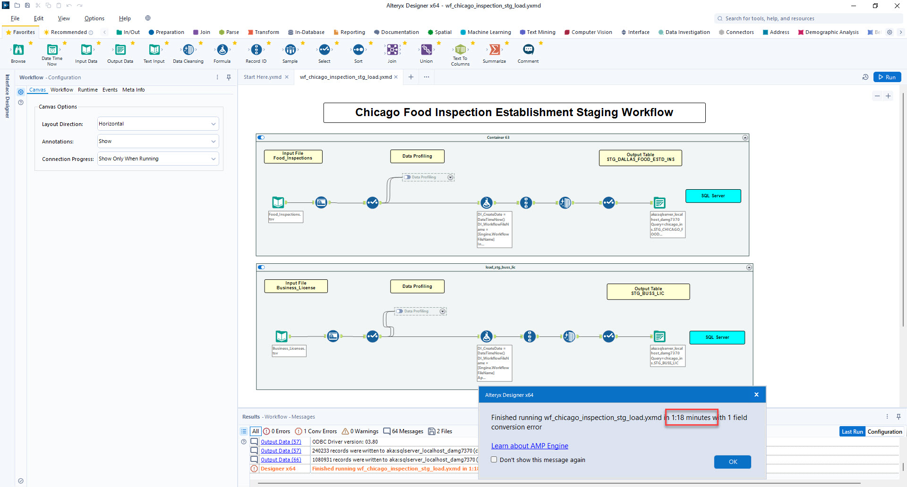
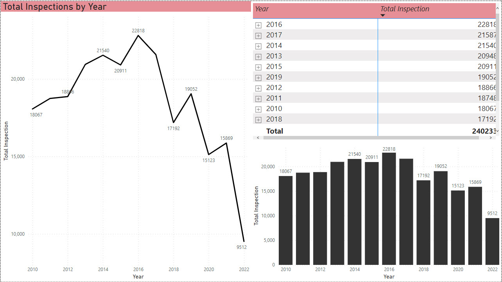
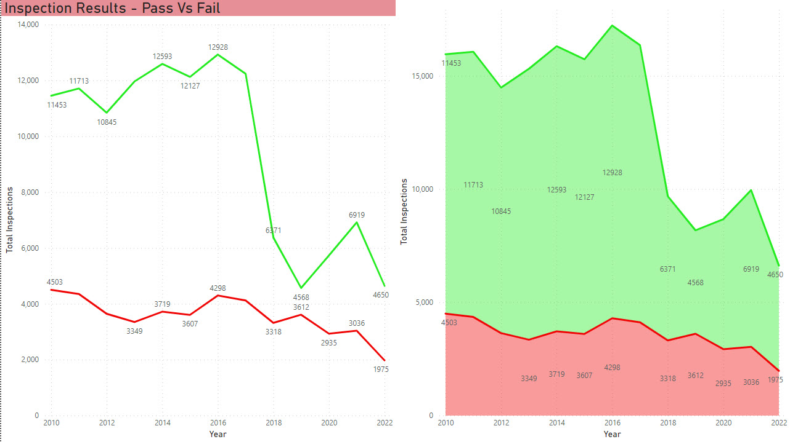
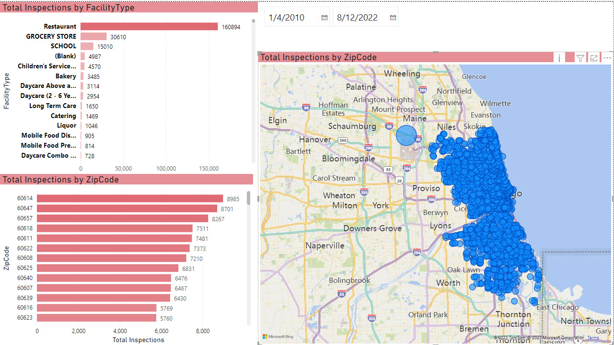

# Chicago Food Inspections

 

 

## Problem Definition

In this dataset sourced from Chicago Data portal, we need to design and implement a data engineering solution that can integrate, transform, and load this data into a centralized data warehouse, enabling the data analysts and scientists to easily access and analyze it. The solution must be scalable, resilient, and secure, able to handle increasing data volumes and diverse data types while ensuring data integrity and compliance with data protection regulations. The ultimate goal of this data engineering solution is to enable our organization to make data-driven decisions, improve customer engagement, and drive business growth.

## Learning

This project has a strong emphasis on applied learning. I got to analyze restaurants inspections and violations happening in Chicago, using information from the Chicago Data portal to build a data engineering pipeline involving data extraction, data cleansing, transformation, exploratory analysis, data visualization, and data flow orchestration of event data on the cloud.

**Data Owner: Chicago Department of Public Health**

## Data Source

This information is derived from inspections of restaurants and other food establishments in Chicago from January 1, 2010 to the present. Inspections are performed by staff from the Chicago Department of Public Health’s Food Protection Program using a standardized procedure. The results of the inspection are inputted into a database, then reviewed and approved by a State of Illinois Licensed Environmental Health Practitioner (LEHP). 

The dataset for this project is acquired from Chicago Data Portal:
https://data.cityofchicago.org/Health-Human-Services/Food-Inspections/4ijn-s7e5

## Data Description

This dataset consists of below metadata information:
|              Metadata                |   Value  |
|:------------------------------------:|:--------:|
|               Rows                   |    443K  |
|             Columns                  |     17   |
|          Update Frequency            |   Daily  |
|             File Format              |    csv   |

## Tools 

Below tools have been utilized for the various segments involving Data Profiling, Modeling, Integration and BI Reporting and Visualizations:

  
     
		
 	
     

 

  
     
		
 	<a href="#">
         
     

## Data Modeling

This project leverages the capability of ER/Studio Data Architect to design, visualize, and manage data models and metadata for the database. ER/Studio allowed to create conceptual, logical, and physical data models and map the relationships and dependencies between them.

  
   
			
     
	Figure 1 : New York City Food Inspection Stage Data Model

 

  
   
			
     
	Figure 2 : New York City Food Inspection Dimensional Data Model

## Data Integration / ETL Pipeline

In this project, data is analysed, profiled, transformed and loaded into Microsoft SQL server by Alteryx. Data is collected in the form of flat files (csv/tsv) and is moved to landing zones (Stage) in SQL Server.

The ETL process involved 2 layer of data landing, transformation and loading.
- **Landing or Staging Data Layer**: The data is extracted form source and staged into the SQL Server database. Here the main focus is to land the data from source without minimal transformation (as-is data load). Also, ETL Audit fields such as DI_FILENAME, DI_WORKFLOWNAME, DI_CREATEDATE etc. were added to identify newly loaded or updated records by using audit columns.

	|              Schema                  |             Table  	   |
	|:------------------------------------:|:-------------------------:|
	|               NYC_INS                |    STG_NYC_FOOD_ESTD_INS  |

  
   
			
     
	Figure 3 : New York City Food Inspection Staging Workflow

 
	
- **Dimensional Data Layer**: Data is loaded to multi-fact dimensional data warehouse after performing extraction from Stage and transformation with defined rules and performed data quality checks post data load. I also addded DI attributes (audit columns) to each dimension and fact for record audit and maintenance.

	|              Schema                  |             Table  	   |
	|:------------------------------------:|:-------------------------:|
	|               NYC_INS                |    Dim_NYC_Addresses  |
	|               NYC_INS                |    Dim_NYC_Borough  |
	|               NYC_INS                |    Dim_NYC_Critical_Flag  |
	|               NYC_INS                |    Dim_NYC_Cuisine  |
	|               NYC_INS                |    Dim_NYC_Inspection_Actions  |
	|               NYC_INS                |    Dim_NYC_Inspection_Grades  |
	|               NYC_INS                |    Dim_NYC_Inspection_Type  |
	|               NYC_INS                |    Dim_NYC_Food_Places
	|               NYC_INS                |    Dim_NYC_Violation_Codes  |
	|               NYC_INS                |    FCT_NYC_Food_Inspections  |
	|               NYC_INS                |    FCT_NYC_FoodInspection_Violations  |
 

  
   
			
     
	Figure 4 : New York City Food Inspection Dimensional Workflow (Dimension Container)

 

  
   
			
     
	Figure 5 : New York City Food Inspection Dimensional Workflow (Fact Container) 

 

## BI Reporting

BI reporting—preparing, analyzing, and portraying business metrics is fundamental to every business. The goal of BI reporting is to provide data insights to support decision making. This project leverages the potential of Power BI and Tableau to derive key business insights by identifying key measurements such as Satisfaction level and apply dimensions such as Inspection date, Restaurant and Violation Code information. The BI reports and dashboards developed as part of this project serves the purpose of identifying the violations in health norms and regulations at restaurants and cafeterias in New York City. Some of the snapshots of the dashboards are attached below:

  
   
			
     
	Figure 6 : Executive Summary Dashboard

 

  
   
			
     
	Figure 7 : Inspection Results over Time

 

  
   
			
     
	Figure 8 : Critical Violations Distribution by Neighborhood

 

  
   
			
     
	Figure 9 : Inspection Results by Geography (Tableau Maps)

 
